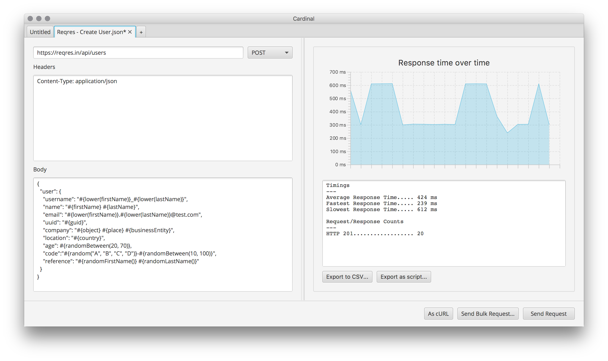

# Cardinal

Cardinal is a simple REST client designed for developers interested in testing their APIs with realistic and varied data.



To get started with Cardinal, [download the latest release](https://github.com/ben-dale/cardinal/releases) and head over to [getting started guide](docs/overview.md)!

### Development

#### Running tests
```
./gradlew test
```

#### Running in development
```
./gradlew run
```

#### Building a release image

The following command will invoke jlink which will output a release image under `/build/image`.
```
./gradlew jlink
```
Application launchers can be found under `/build/image/bin`: `cardinal` for Mac and Linux, and `cardinal.bat` for Windows.
