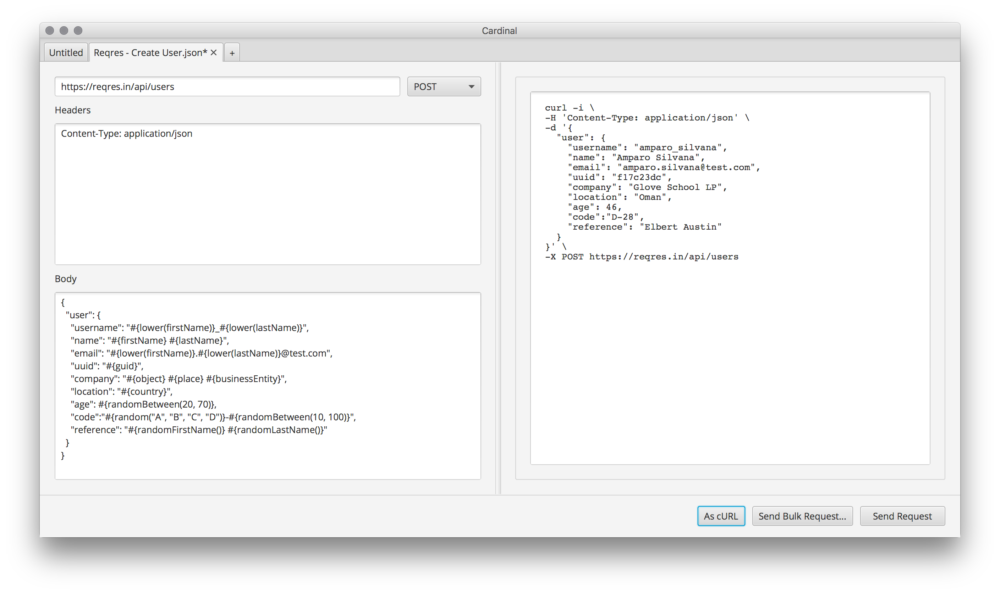
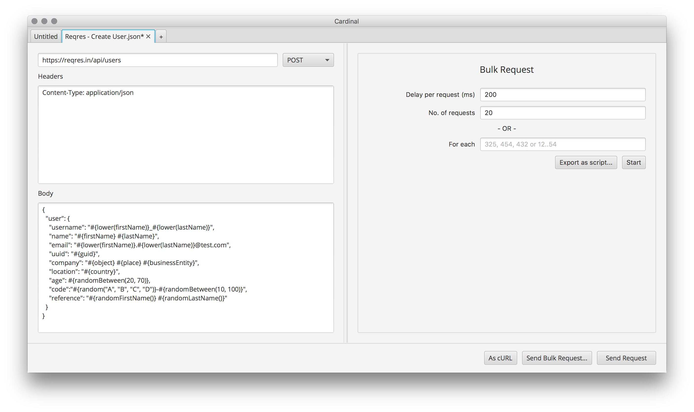
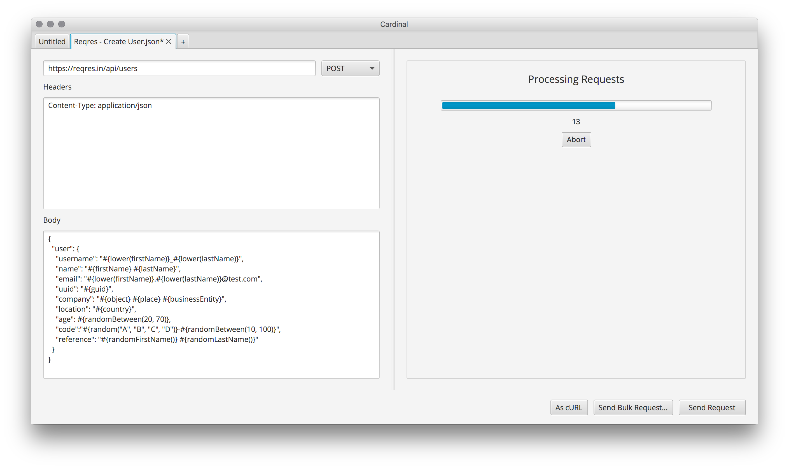
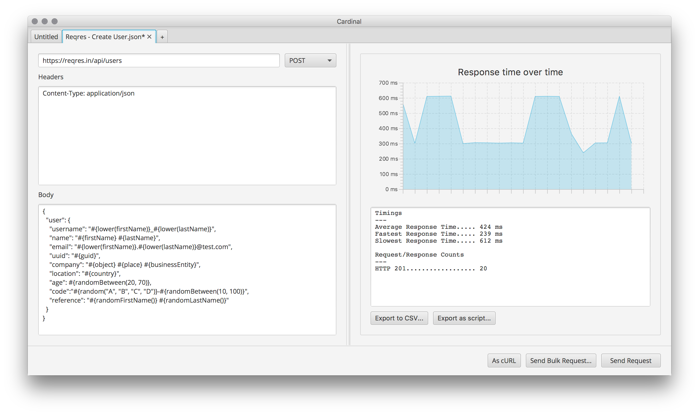

# Getting Started

### Templates
Arguably the most powerful feature of Cardinal is the request templating.

Cardinal treats requests as templates. Before sending a request Cardinal processes variables and functions present in the request template and replaces them with appropriate values.



In the above example, a request template to create a user was provided on the left. Each time "As cURL" is clicked, the template is processed, the variables and functions are rewritten with values and the cURL command is built up.

#### Variables
Cardinal comes with a list of predefined variables. Each variable is instantiated with a value during the processing of a request; if for example, you use the `#{firstName}` variable more than once in a single request template, it will have the same value each time it is referenced. If a unique first name (for example) is needed, you can use one of the random functions mentioned in the following section.

| Variable   	            | Example   	|
|---	                    |---	        |
| `#{guid}` 	            | f17c23de 	    |
| `#{int}`    	            | 1118345848    |
| `#{float}`                | 0.91777223    |
| `#{firstName}`            | Dierdre    |
| `#{lastName}`             | Verona    |
| `#{action}`               | Repair    |
| `#{businessEntity}`       | PLC    |
| `#{communication}`        | Call    |
| `#{country}`              | Japan    |
| `#{object}`               | Car    |
| `#{place}`                | Hospital    |
| `#{emoji}`                | 🍏 |

#### Functions

Cardinal has a few limited functions that help with string manipulation and entropy.

| Function   	                    | Example   	|
|---	                            |---	        |
| `#{randomGuid()}` 	            | b2519c1f 	    |
| `#{randomInt()}`    	            | 1043257081    |
| `#{randomFloat()}`                | 0.5201468    |
| `#{randomFirstName()}`            | Juliana    |
| `#{randomLastName()}`             | Giuseppina    |
| `#{randomAction()}`               | Question    |
| `#{randomBusinessEntity()}`       | CIO    |
| `#{randomCommunication()}`        | Email    |
| `#{randomCountry()}`              | Denmark    |
| `#{randomObject()}`               | Armchair    |
| `#{randomPlace()}`                | Supermarket    |
| `#{randomEmoji()}`                | 🚗 |
| `#{random("A", "B", "C")}`        | A    |
| `#{randomBetween(20, 50)}`        | 45    |
| `#{lower("HELLO")}`               | hello    |
| `#{upper("hello")}`               | HELLO    |
| `#{capitalise("hello")}`          | Hello |
| `#{lorem(4)}`                     | Lorem ipsum dolor sit |

You can also combine variables and functions and nest functions, for example:
```
#{random(lower("HELLO"), upper("world"))} => hello|WORLD
#{lorem(randomBetween(1, 3))} =>  Lorem|Lorem ipsum|Lorem ipsum dolor
#{capitalise(random("hello", "world"))} => Hello|World
#{lower(firstName)} => frank
```

The quickest way to make sure your templates are being processed as expected is to output as a cURL command. Once you're happy that the request template is being processed correctly, send a single request and then move on to sending bulk requests.

Variables and functions can be used in the request headers, the request body and the request URL. 

### Bulk Requests

When combined with the templating aspect of Cardinal, sending bulk requests can be a quick and easy way to flood an API you're working against with unique and realistic data.



"Delay per request (ms)" is the number of milliseconds to delay between each request being sent.

"No. of requests" is the number of requests in total to send.

"For each" can be provided instead of "No. of requests" and is useful if you know what values you want to iterate over, say for example, a list of identifiers. When provided this will send a request for each value in the list replacing `#{id}` with the current value.

For example, if "For each" was set to "45, 684, 24", three requests would be sent and the variable `#{id}` would be set to "45", then "684" and finally "24".

E.g.
```
GET test.com/api/#{id}
```
would result in the follow requests:
```
GET test.com/api/45
GET test.com/api/684
GET test.com/api/24
```

Note that `#{id}` is only processed when using the "For each" option when sending bulk requests; it will not be processed when converting the request to cURL, for example. 

### Sending Bulk Requests

Once you're happy with the request template and the set bulk request parameters, you can either send the requests directly from Cardinal or export the requests as a script.
 
Clicking "Export as script..." will process all of the request templates and write them to a bash script using cURL as the client. The script can then be ran on any machine that has bash and cURL support. This is especially useful if you want to quickly distribute a bulk request script to friends or colleagues that might not have a copy of Cardinal to hand.
 
Clicking "Start" will being sending the requests directly from Cardinal.



You can interrupt the process at any point and this will take you to the summary screen.

### Bulk Request Results

Once finished (or interrupted), the summary screen will appear.



This shows a breakdown of the response time, over time, and a summary of counts for each HTTP response.

Clicking "Export to CSV..." will export the summary of each request and the assocated response to a CSV file so that each request and response can be inspected individually.

Clicking "Export as script..." will export the requests that were sent to a bash script so that the exact same bulk request can be sent again.

### Extras

If you're interested in the evolution of Cardinal over time, checkout the timeline [here](timeline.md)!